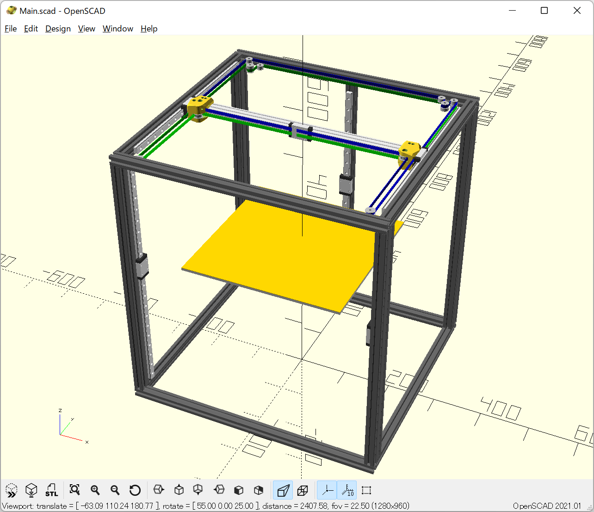
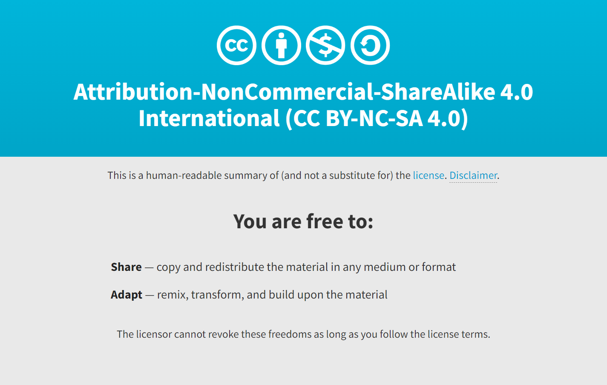

# OpportuniXY-330 3D Printer

OpportuniXY-330 is a 3D printer based on the TRONXY X5SA frame. The bed size is 330mm square. It is designed based on Core-XY kinematics and side mounted linear rails motion system.

It is work in progress.

## Requirements

The SCAD code is worked on OpenSCAD with NopSCADlib and BOSL2 libraries.

## Printed parts

The following parts are available:

* XY carriage
* AB idler mount

Other parts are work in progress.

### Print settings

Voron's standard print settings are recommended.

## The concepts

The OpportuniXY-330 aims at high precision 3D printing at a low cost.

### Side mounted linear rails

If the steel linear rails are mounted on top of the aluminum gantry on X or Y axis, the nozzle is moving down in printing. Otherwise, if these linear rails are mounted under the gantry, the nozzle is moving up in printing. It is the bi-metal issue with the differences of the coefficient of thermal expansion between aluminum and steel. This issue is especially noticeable when low speed high precision printing.

The OpportuniXY-330 chose a practical solution: the linear rails are side mounted to solve it.

### The belt path

The OpportuniXY-330 chose the reverse belt path rather than the old schooled forward path for suppression belt resonance.

## Authors

marbocub - Initial work

## License

Copyright (c) 2022 marbocub marbocub@gmail.com, All rights reserved.

This work is licensed under the Creative Commons Attribution-NonCommercial-ShareAlike 4.0 International License (CC-BY-NC-SA 4.0) - see the [LICENSE](LICENSE) file for details.

<!--

-->

### Only CoreXYReversedSpecial.scad subsystem

Copyright (c) 2022 marbocub marbocub@gmail.com, All rights reserved.

Based on [core_xy.scad](https://github.com/nophead/NopSCADlib/blob/master/utils/core_xy.scad) of NopSCADlib.
Copyright Chris Palmer 2020 nop.head@gmail.com

This program is distributed in the hope that it will be useful, but WITHOUT ANY WARRANTY; without even the implied warranty of MERCHANTABILITY or FITNESS FOR A PARTICULAR PURPOSE.

This program is free software; you can redistribute it and/or modify it under the terms of the GNU General Public License version 3 as published by the Free Software Foundation, see [LICENSE-GPLv3](LICENSE-GPLv3).

