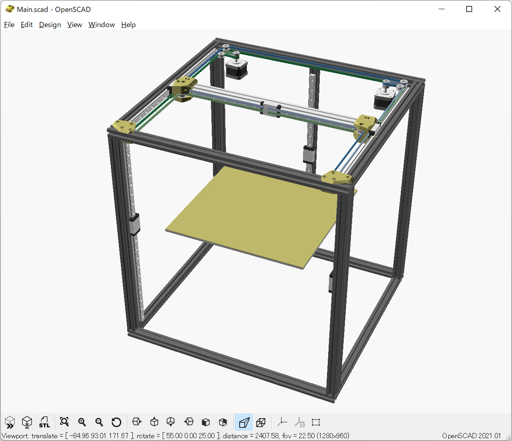

# Opportunity-330 3D Printer

Opportunity-330 is a 3D printer based on the TRONXY X5SA frame. The bed size is 330mm square. It is designed based on Core-XY kinematics and side mounted linear rails motion system.

It is work in progress.

## Authors

marbocub - Initial work

## License

Copyright (c) 2022 marbocub marbocub@gmail.com, All rights reserved.

This work is licensed under the Creative Commons Attribution-NonCommercial-ShareAlike 4.0 International License (CC-BY-NC-SA 4.0) - see the [LICENSE](LICENSE) file for details.

### Only CoreXYReversedSpecial.scad subsystem

Copyright (c) 2022 marbocub marbocub@gmail.com, All rights reserved.

Based on [core_xy.scad](https://github.com/nophead/NopSCADlib/blob/master/utils/core_xy.scad) of NopSCADlib.
Copyright Chris Palmer 2020 nop.head@gmail.com

This program is distributed in the hope that it will be useful, but WITHOUT ANY WARRANTY; without even the implied warranty of MERCHANTABILITY or FITNESS FOR A PARTICULAR PURPOSE.

This program is free software; you can redistribute it and/or modify it under the terms of the GNU General Public License version 3 as published by the Free Software Foundation, see [LICENSE-GPLv3](LICENSE-GPLv3).
